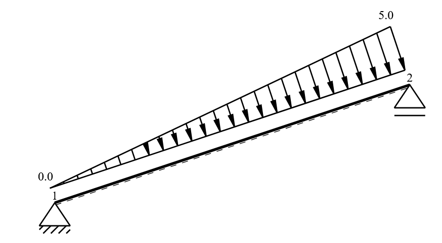
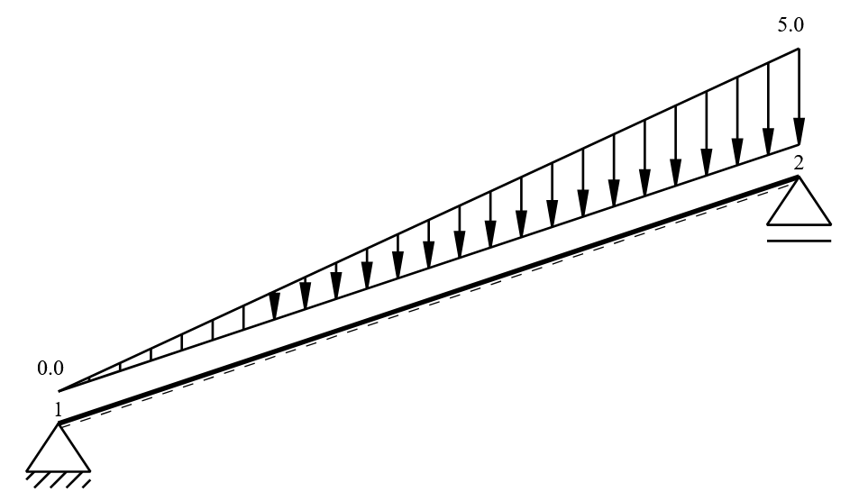
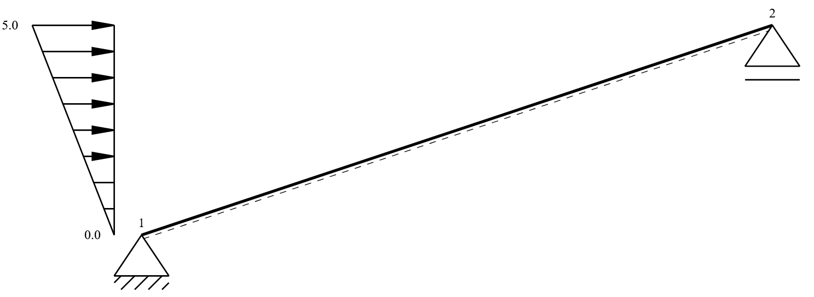

Bar
===

This section demonstrates practical tasks for working with beam elements (bars) in the structural system.

Create a Bar
------------

A bar connects two nodes and requires a cross-section and material.
Diese Parameter sind notwendig um einen Stab zu modellieren.
Modellieren wir nun einen Beispielstab:

.. code-block:: python

    from sstatics.core.preprocessing import Bar, CrossSection, Material, Node

    # Define cross-section and material
    cross_sec = CrossSection(0.00002769, 0.007684, 0.2, 0.2, 0.1)
    material = Material(210000000, 0.1, 81000000, 0.1)

    # Define nodes
    n1 = Node(0, 0, u='fixed', w='fixed')
    n2 = Node(3, -1, w='fixed')

    # Define bar
    bar = Bar(n1, n2, cross_sec, material)

Dieser Stab kann nun über die Klasse ``BarGraphic`` dargestellt werden

.. code-block:: python

    from sstatics.graphic_objects import BarGraphic

    # Plot bar
    BarGraphic(bar).show()

.. image:: images/create_bar.png
   :alt: bar
   :align: center

Enable or Disable Deformations
------------------------------

Bars can deform in axial, bending, and shear directions. You can choose which
deformation components to consider in the analysis.

.. code-block:: python

    # Enable only moment and shear deformation, disable normal
    bar.deformations = ['moment', 'shear']

.. code-block:: python
    from sstatics.core.preprocessing import Bar, CrossSection, Material, Node

    # Define cross-section and material
    cross_sec = CrossSection(0.00002769, 0.007684, 0.2, 0.2, 0.1)
    material = Material(210000000, 0.1, 81000000, 0.1)

    # Define nodes
    n1 = Node(0, 0, u='fixed', w='fixed')
    n2 = Node(3, -1, w='fixed')

    # Define bar with deformation components
    bar = Bar(n1, n2, cross_sec, material, deformations=['moment', 'shear'])

Apply a Line Load
-----------------

Line loads act along the bar length. They can be defined locally or globally and will
be included in the internal force vector.

.. code-block:: python

    from sstatics.core.preprocessing import BarLineLoad

    line_load = BarLineLoad(pi=0, pj=5, direction='z', coord='bar', length='exact')
    bar.line_loads = line_load

.. code-block:: python

    from sstatics.core.preprocessing import BarLineLoad

    line_load = BarLineLoad(pi=0, pj=5, direction='z', coord='system', length='exact')
    bar.line_loads = line_load

.. code-block:: python

    from sstatics.core.preprocessing import BarLineLoad

    line_load = BarLineLoad(pi=0, pj=5, direction='z', coord='system', length='proj')
    bar.line_loads = line_load

.. image:: images/lineload_system_z_proj.png
   :alt: Line load acting on bar in z direction in system coordinate system on projected length
   :align: center

.. code-block:: python

    from sstatics.core.preprocessing import BarLineLoad

    line_load = BarLineLoad(pi=0, pj=5, direction='x', coord='bar', length='exact')
    bar.line_loads = line_load

.. image:: images/lineload_bar_x.png
   :alt: Line load acting on bar in x direction in bar coordinate system
   :align: center

.. code-block:: python

    from sstatics.core.preprocessing import BarLineLoad

    line_load = BarLineLoad(pi=0, pj=5, direction='x', coord='system', length='exact')
    bar.line_loads = line_load

.. image:: images/lineload_system_x_exact.png
   :alt: Line load acting on bar in x direction in system coordinate system on exact length
   :align: center

.. code-block:: python

    from sstatics.core.preprocessing import BarLineLoad

    line_load = BarLineLoad(pi=0, pj=5, direction='x', coord='system', length='proj')
    bar.line_loads = line_load

Apply a Point Load
-----------------

Point loads act at a specific location along the bar.

.. code-block:: python

    from sstatics.core.preprocessing import BarPointLoad

    point_load = BarPointLoad(px=0, pz=10, position=0.83)
    bar.point_loads = [point_load]

.. image:: images/barpointload.png
   :alt: Pointload acting along the bar
   :align: center

Apply a Temperature Load
------------------------

Use BarTempLoad to define the thermal effect. The unit for temperature is Kelvin.

.. code-block:: python

    from sstatics.core.preprocessing import BarTempLoad

    temp_load = BarTempLoad(30, 10)
    bar.temp = temp_load

.. image:: images/bar_temperature.png
   :alt: Temperature load along the bar
   :align: center