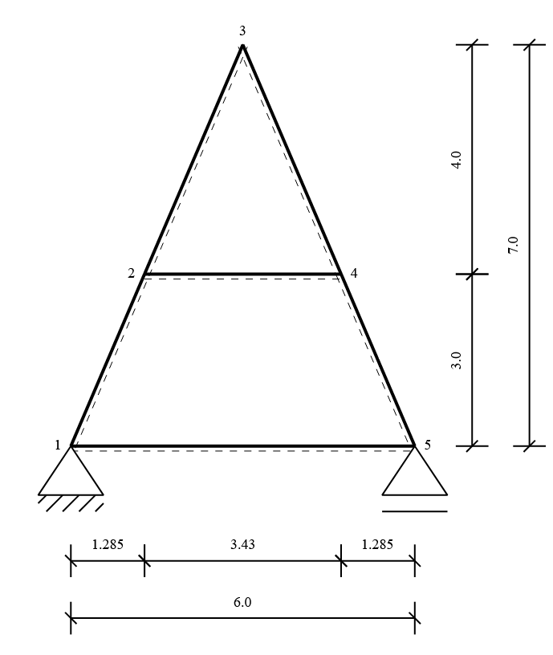

========================================================
Example 2: Transforming a Roof Truss to a Primary System
========================================================

In this example we will look at a **roof truss structure** similar to a simple timber roof.
The truss is supported at both ends at the bottom, which makes the system **statically indeterminate**.
Our task here is not to calculate internal forces, but to a statically de.
This is an important preparation step for later use of the **force method**.

**Task**

* Model the roof truss system with its members and supports,
* Identify that the system is statically indeterminate,
* Release redundant constraints or introduce hinges to obtain a **primary system**,
* Visualize both the original and the modified system.

**Roof Truss System**

.. note::
   The goal of this exercise is to understand how to transform the original system
   into a primary system by carefully modifying the supports and connections.
   No calculation of internal forces is carried out in this example.

Step 1: Define Cross-Section and Material
-----------------------------------------

We assume two different cross-sections for rafters and struts/ties.
The material is defined as wood with an elastic modulus.

.. code-block:: python

    from sstatics.core.preprocessing import CrossSection, Material

    cross_sec_1 = CrossSection(65506.67e-8, 0.068, 0.34, 0.2, 0.1)
    cross_sec_2 = CrossSection(36000e-8, 0.048, 0.3, 0.16, 0.1)
    material = Material(1400000, 0.1, 0.1, 0.1)

Step 2: Define Nodes
--------------------

The geometry of the truss is represented by five nodes:

* **Node 1**: left support (fixed in u and w),
* **Node 2**: lower left joint,
* **Node 3**: ridge,
* **Node 4**: lower right joint,
* **Node 5**: right support (fixed in w).

.. code-block:: python

    from sstatics.core.preprocessing import Node

    n1 = Node(0, 0, u='fixed', w='fixed')   # Left support
    n2 = Node(1.285, -3)                    # Lower left joint
    n3 = Node(3, -7)                        # Ridge
    n4 = Node(4.715, -3)                    # Lower right joint
    n5 = Node(6, 0, w='fixed')              # Right support (only vertical fixed)

Step 3: Define Bars
-------------------

We connect the nodes with bars to model rafters, tie beam, and struts.

.. code-block:: python

    from sstatics.core.preprocessing import Bar

    b1 = Bar(n1, n2, cross_sec_1, material)
    b2 = Bar(n2, n3, cross_sec_2, material)
    b3 = Bar(n3, n4, cross_sec_2, material)
    b4 = Bar(n4, n5, cross_sec_1, material)
    b5 = Bar(n1, n5, cross_sec_1, material)  # tie beam
    b6 = Bar(n2, n4, cross_sec_2, material)  # horizontal strut

Step 4: Create Original System
------------------------------

.. code-block:: python

    from sstatics.core.preprocessing import System
    from sstatics.graphic_objects import SystemGraphic

    original_system = System([b1, b2, b3, b4, b5, b6])
    SystemGraphic(original_system).show()

At this stage the structure is **statically indeterminate**.
The combination of fixed and semi-fixed supports together with closed triangles introduces redundancies.

Step 4: Check Degree of Static Indeterminacy
--------------------------------------------

Before we release any support, we can calculate the **degree of static indeterminacy** of the system.

.. code-block:: python

    from sstatics.core.postprocessing import KGV

    force_method = KGV(original_system)
    # Check degree of indeterminacy
    force_method.degree_of_static_indeterminacy()

**Output:**

.. code-block::

    6

This means that the system is **six times statically indeterminate**.
In other words, six redundant restraint must be removed in order to obtain a primary system.

Step 5: Modify to Primary System
--------------------------------

To obtain a **primary system**, we must release redundant constraints or member fixities.
This is done by introducing hinges, modifying the node support and/or removing a redundant bar.

In this example:
* the strut (b6) is being deleted
* the tie beam (b5) is released with hinges at both ends,
* additionally, a hinge is introduced at the upper end of bar b2.

.. code-block:: python

    # Apply modifications
    force_method.delete_bar(b5)
    force_method.modify_bar(b6, 'hinge_phi_i')
    force_method.modify_bar(b6, 'hinge_phi_j')
    force_method.modify_bar(b2, 'hinge_phi_j')

Step 6: Visualize the Primary System
------------------------------------

Finally, we can plot the modified system to clearly see the difference
between the redundant and the released structure.

.. code-block:: python

    from sstatics.graphic_objects import SystemGraphic
    SystemGraphic(force_method.get_released_system()).show()

.. note::
   This step is purely for visualization.
   The geometry and supports of the primary system are shown,
   but no internal forces are calculated at this stage.

**Summary**

- The original roof truss is **statically indeterminate** due to redundant supports and connections.
- By releasing bars and adding hinges, the system is transformed into a **primary system**.
- This step is essential as a preparation for later application of the force method.

